# Art Speaks — Architecture

How the whole app fits together: request → render, click → order, sign up →
session. Written for someone who knows the codebase exists but hasn't traced
the wiring yet.

Last updated 2026-08-19. If a diagram here disagrees with the code, trust the
code and fix this file — a stale architecture doc is worse than none, because
it's trusted (see the note at the top of `CLAUDE.md`).

---

## 1. The shape of the system

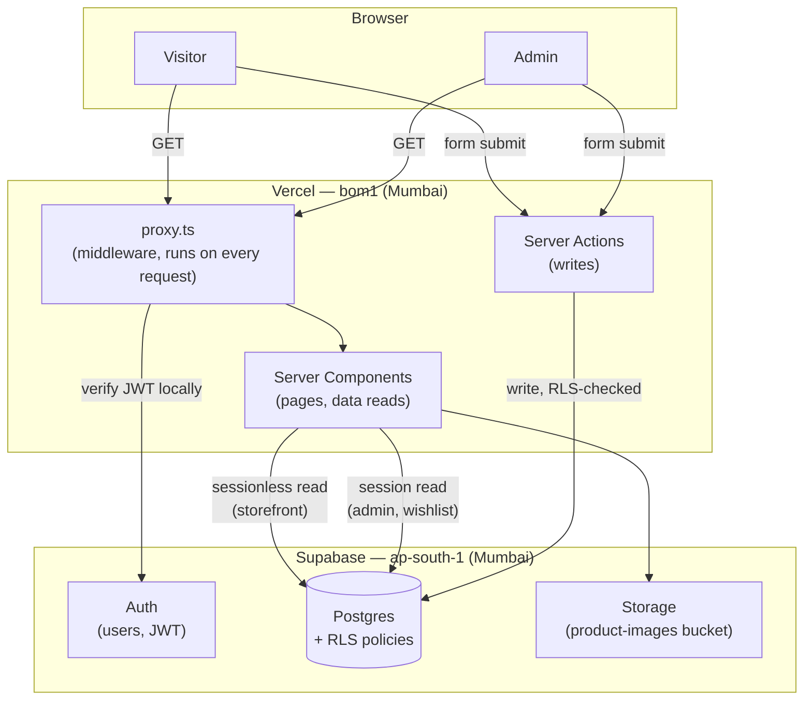

Two data paths through the same Postgres database, and the distinction matters
everywhere below:

- **Sessionless reads** (`lib/supabase/public.ts`) — no cookie, no user. RLS
  sees an anonymous request, so it returns only what a stranger may see:
  active products, public categories. Used for the storefront, and safe to
  cache for everyone because there's nothing user-specific in the result.
- **Session reads** (`lib/supabase/server.ts`) — carries the visitor's cookie.
  RLS evaluates `auth.uid()` and `is_admin()`, so an admin sees unpublished
  products and every order; a customer sees their own wishlist. Can't be
  cached across users, because the result *is* user-specific.

Mixing these up is the one mistake that would leak data, which is why
`CLAUDE.md` calls it out explicitly.

---

## 2. Authentication

### 2.1 Sign up (confirmation is currently OFF)

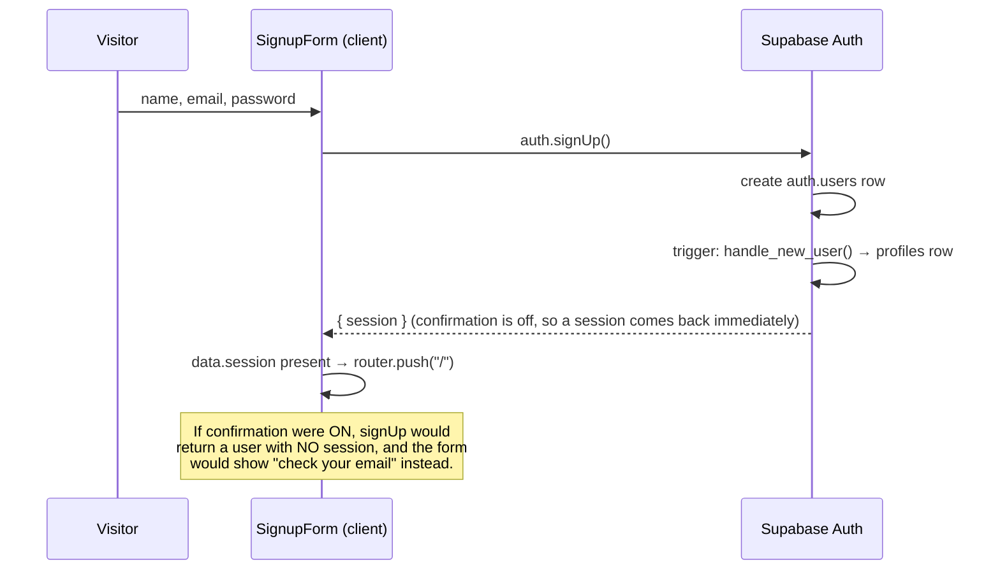

`profiles.is_admin` defaults to `false` — nobody signs up as an admin.

**Why confirmation is off:** nothing in the app reads `email_confirmed_at`. An
account gates exactly one thing today (the wishlist), orders are guest
checkout and never linked to an account, and the studio confirms over
WhatsApp. Verifying an email was protecting nothing while costing a broken
cross-device link flow. Turn it back on when accounts hold something worth
protecting — the planned order-history feature is the trigger (see
`docs/ROADMAP.md`).

### 2.2 Sign in

```mermaid
sequenceDiagram
    participant U as Visitor
    participant F as LoginForm
    participant S as Supabase Auth

    U->>F: email, password
    F->>S: signInWithPassword()
    alt correct
        S-->>F: session cookie set
        F->>F: router.push(next); router.refresh()
    else wrong password OR no such account
        S-->>F: "Invalid login credentials"
        F->>U: "That email or password didn't work."
    end
```

One error message for both failure modes, deliberately — distinguishing "no
account" from "wrong password" would let anyone probe which emails are
registered.

### 2.3 Forgotten password

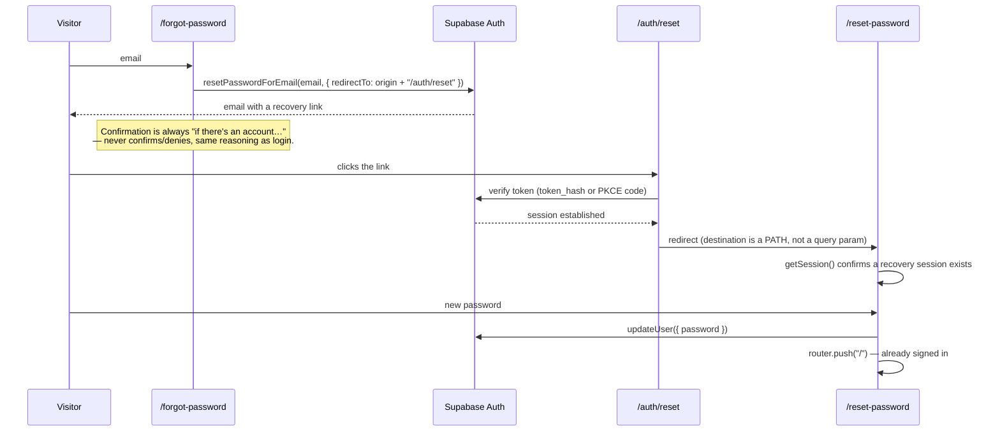

**Why the destination is a path (`/auth/reset`), not `?next=/reset-password`:**
Supabase's own `/auth/v1/verify` sits in the middle of this flow. It consumes
the token, then redirects to `redirect_to` — appending its own query
parameters as it goes. A `next` value stuffed into the query string didn't
survive that hop; it silently vanished and `safeRedirectPath` fell back to
`/`. A path can't be dropped that way, because nothing but Supabase's own
token has to survive the trip.

Signup and password-reset links intentionally share one verifier
(`lib/auth/verify-email-link.ts`) rather than duplicating the "handle both
`token_hash` and PKCE `code`" logic — a fix landing in only one copy is a bug
nobody notices until the other flow breaks.

### 2.4 The admin check — a JWT claim, not a query

This is the part worth understanding in most detail, because it's the one
piece of the auth system that isn't the obvious/default way to do it.

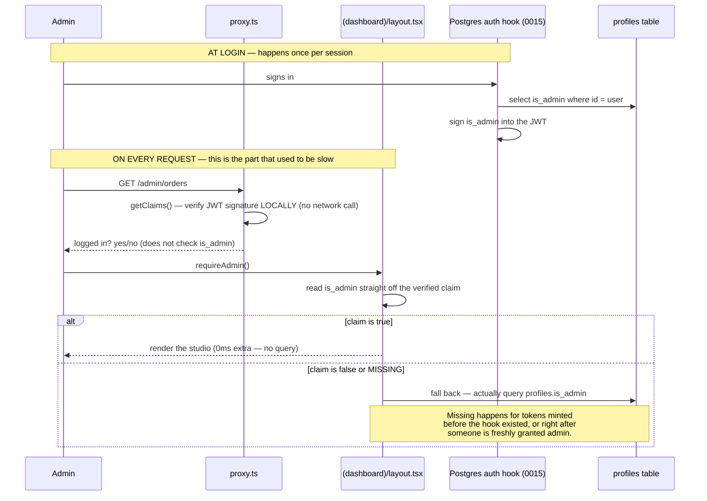

Before this (migration `0015`), every single admin page paid a real database
round trip just to answer "is this person an admin?" — measured at ~600ms on
this connection, in front of *every* render, for a boolean that changes maybe
once a year. Reading it off an already-verified token costs nothing.

**The asymmetry that makes this safe:**

| | Effect |
|---|---|
| **Granting** admin | Instant — the very next request that needs a fresh token re-checks the database (missing/false claim → fallback path) |
| **Revoking** admin | Delayed up to ~1 hour, until the token naturally refreshes |

That delay sounds risky until you look at what it actually delays: **only
rendering.** It never delays what someone can *do*. RLS reads
`profiles.is_admin` directly, on every single query, regardless of what the
JWT claims. A revoked admin holding a stale token gets an admin-shaped screen
where every button fails — an empty room with every drawer locked. For an
instant lockout regardless, delete their session in
Authentication → Users → Sign Out.

### 2.5 Why a customer can't just PATCH themselves into being an admin

This was verified end-to-end against production, not just read from the
migration:

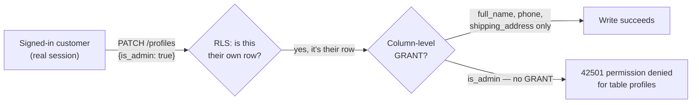

RLS only gates **rows** — "is this your profile?" — and the answer to that is
always yes for your own row. Postgres has no row-level concept of "but not
this column," so `0004` closes it with a column-level `GRANT`: `authenticated`
can write three specific columns and nothing else. Bundling `is_admin` into
the same request as a legitimate edit doesn't get you a partial win either —
Postgres refuses the whole statement.

---

## 3. The storefront (public, cached, sessionless)

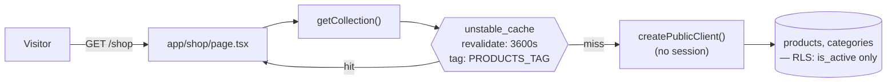

Product and category reads are wrapped in `unstable_cache` with a one-hour
window, tagged `PRODUCTS_TAG`. That's why editing something through the admin
panel appears instantly (the write path calls `updateTag(PRODUCTS_TAG)`,
invalidating it) while a raw SQL edit in the Supabase dashboard does **not** —
nothing tells Next the data moved, so it sits stale for up to an hour. (And on
a dev machine, that cache lives on disk at `.next/dev/cache`, which restarting
the dev server does **not** clear — this has caught two separate changes this
session, a category image and a CSS rule.)

**Search** (`searchProducts`) is substring matching across name, description,
artisan note, slug and category, with `pg_trgm` similarity as a typo-tolerant
fallback (migration `0008`) — so "erasor" still finds "eraser".

---

## 4. Cart → Checkout → Order

### 4.1 The cart lives in the browser, not the database

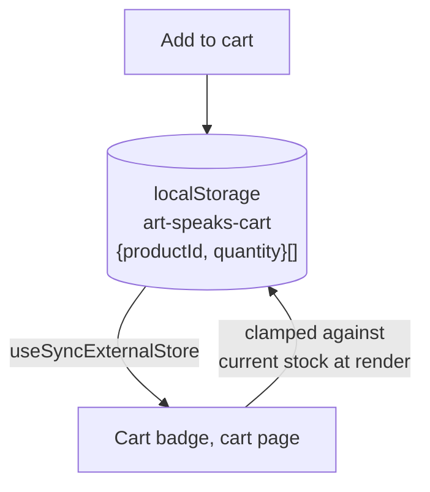

Only `productId` and `quantity` are stored — **never** a name or price.
Prices are looked up fresh every time the cart renders, so a price change
never shows stale. And because it's plain `localStorage`, it's trivially
editable by anyone with devtools; the cart page defends against that by
clamping displayed quantities to current stock before drawing anything (a
basket claiming 100 of something with 3 left renders as 3, with an
explanation), and the `+` stepper won't go past stock in the first place. That
UI clamp is a courtesy — the real backstop is the database function below.

### 4.2 Placing an order

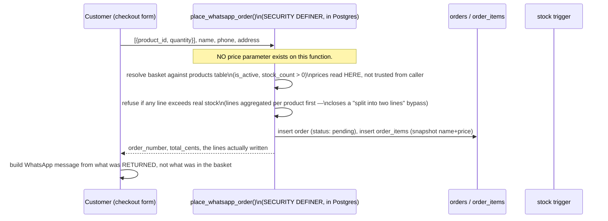

The line "prices read here, not trusted from caller" is doing real work —
there is no code path anywhere by which a browser can tell the server what
something costs.

**Stock only moves on confirmation, not on order.** An order is born
`pending`; nothing is deducted yet. A `BEFORE UPDATE` trigger on `orders`
(from `0010`/`0014`) fires when status changes:

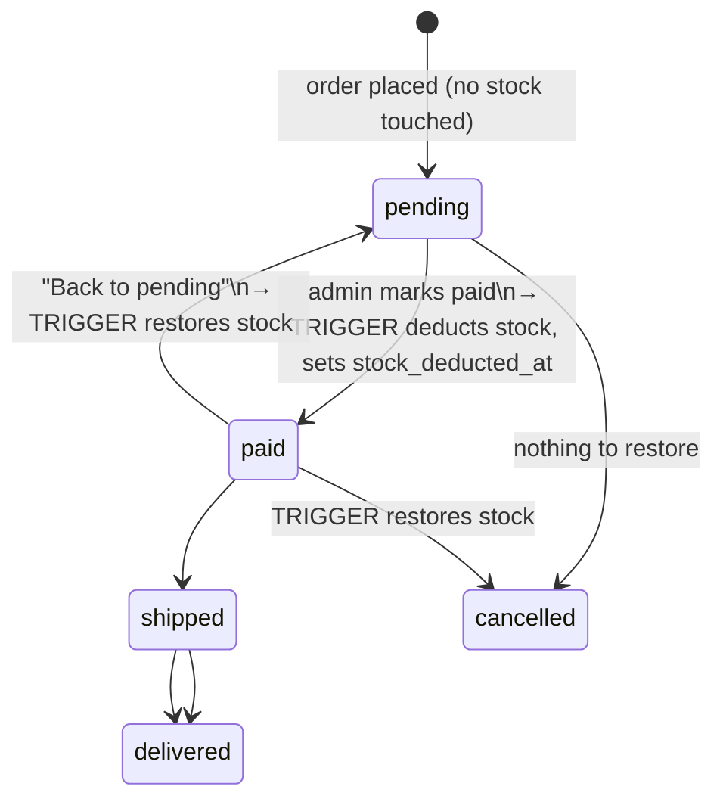

Offline sales (the admin's in-person sale tap-grid) skip straight to `paid`
via a different function (`record_offline_sale`, `0009`) that deducts stock in
the same transaction as the insert — same underlying trigger machinery, one
insert instead of a status change.

---

## 5. Admin panel

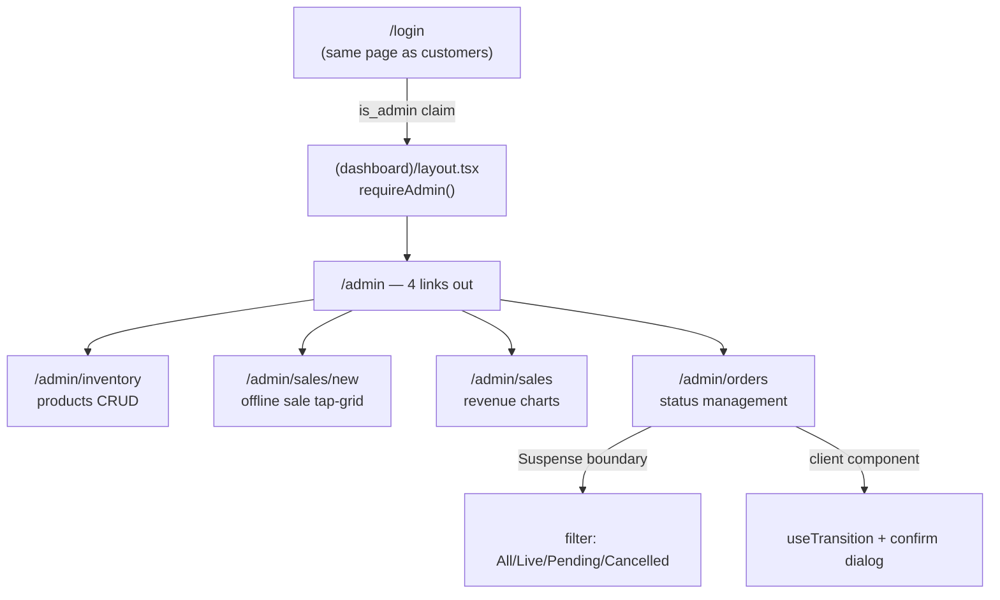

There is **one** login page for the entire site — `is_admin` is a flag on a
profile, not a separate account type. What makes `/admin` different is
`requireAdmin()` in that route group's layout, which redirects a non-admin to
`/` (never back to `/admin/login`, which would loop against the middleware).

**The orders page** is a worked example of a few patterns used throughout the
admin side: the list sits behind `<Suspense>` so the header and filter chips
paint before the query resolves; a click on any status button flips through
`useTransition` so the button shows a spinner rather than the whole screen
looking frozen for the ~1s a status change + re-render takes; and "Cancel" —
the one action with no way back — is the only one that asks for confirmation.

---

## 6. Sales data — two sources, one view

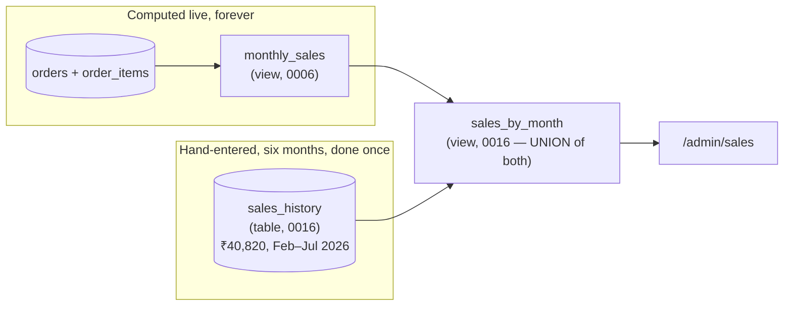

`monthly_sales` is untouched by any of this and still means exactly what it
always meant: revenue computed from real orders. `sales_history` covers the
months before the shop existed as software — a monthly total with **no** line
items, because that's genuinely all that's known about that period. Writing
it as fake `orders` rows was tried and reverted: it would have deducted stock
for pieces that left the studio months ago, and invented a product breakdown
nobody actually recorded.

The seam shows up in the admin UI on purpose: historical months report
`order_count: 0` (how many transactions made up that total is unknown, and
guessing would make the Orders stat lie), so **Revenue** includes the
pre-launch figures while **Orders** and **Pieces sold** count only what the
shop itself processed. The stat tiles carry a one-line hint each, because an
unexplained mismatch reads as a bug.

---

## 7. Deploy

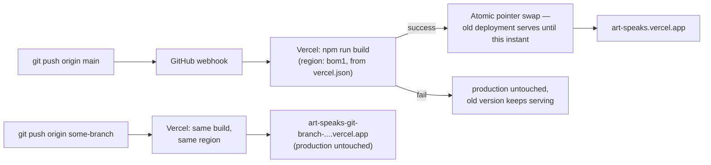

Every push builds a fresh, immutable deployment; nothing is patched in place.
`main` → production, any other branch → a preview at its own URL. A **preview
shares the production Supabase project** — there's one set of env vars — so
it's fine for looking at layout, not for exercising checkout (that writes real
orders and moves real stock).

`vercel.json` pins the function region to `bom1` (Mumbai), matching Supabase's
`ap-south-1`. Getting this wrong doesn't break anything — it just means every
uncached database read crosses the Atlantic and back. It's set in code rather
than the dashboard toggle because it only stays correct as long as the
database stays in this region, and that's a fact that belongs with the code
that depends on it.

---

## 8. Two rules that don't fit neatly in a diagram

**Redirects go through `lib/safe-redirect.ts`**, never a raw `startsWith("/")`
check. `/\evil.com` passes that check and the browser still resolves it
off-site — the backslash gets normalised to a forward slash by the URL parser
after the check has already said yes.

**Money is an integer, in paise**, everywhere: `price_cents`, `total_cents`,
`unit_price_cents`. ₹450 is `45000`. Every admin form takes rupees and
multiplies by 100 in one place; nothing downstream ever does that arithmetic
again.

---

## Where to go next

- `docs/LEARNING-auth-and-backend.md` — the beginner-oriented walkthrough of
  §2 above, written to teach rather than reference
- `docs/ROADMAP.md` — current state, what's deliberately not built, what's
  next
- `supabase/migrations/` — numbered, one file per decision; the comment at the
  top of each explains *why*, not just what changed
