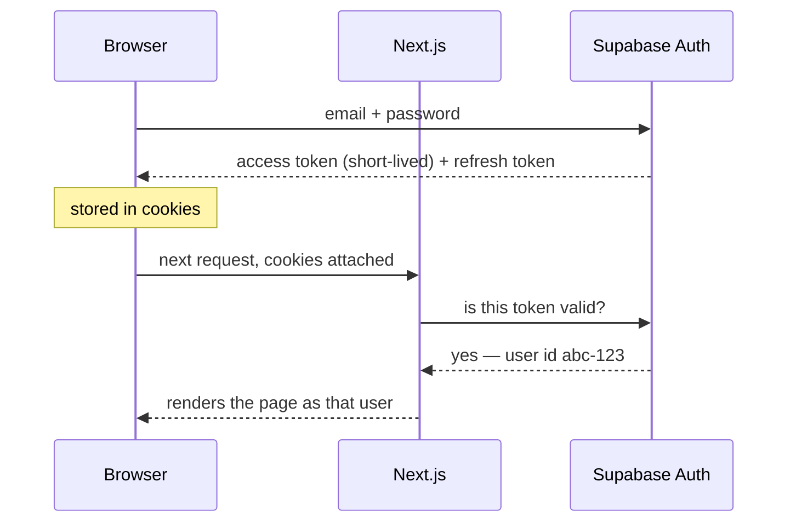
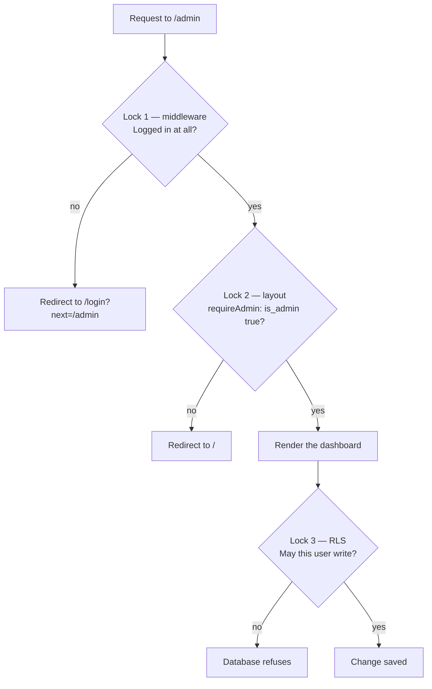
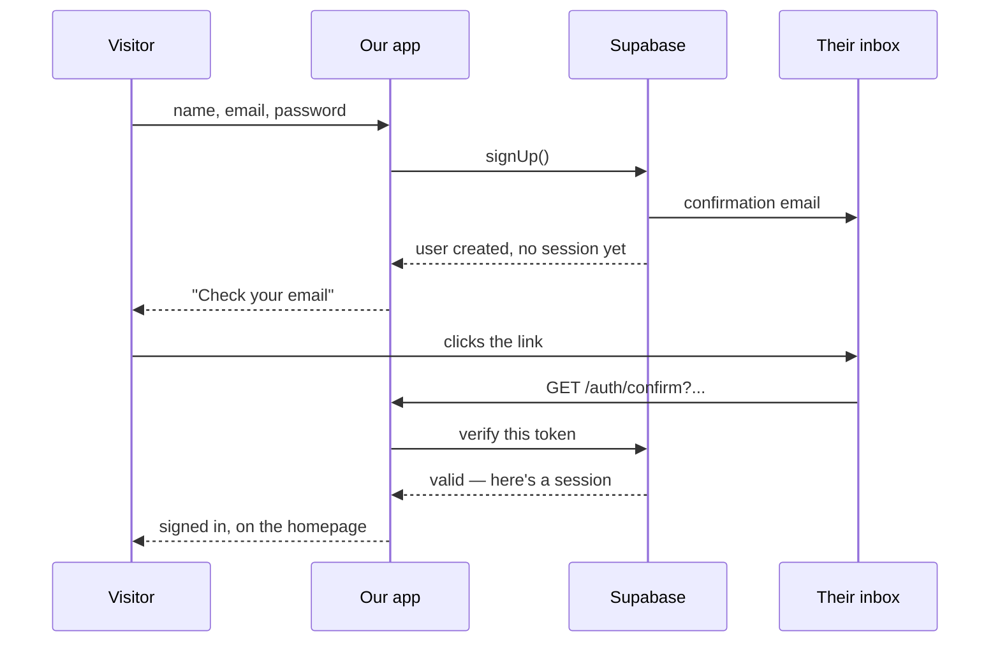
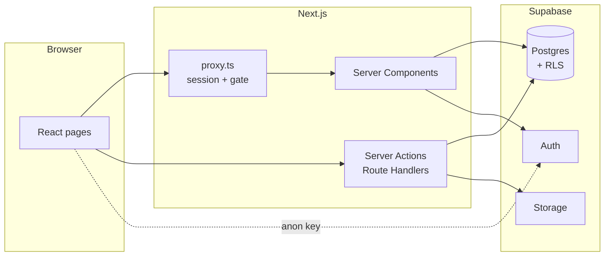

# How the backend and login actually work

A walkthrough of the Art Speaks backend, written for someone who has not built
one before. It explains not just *what* the code does but *why* it is shaped
that way, using the real files in this repo.

Read it top to bottom. Each section builds on the one before.

---

## 1. What "the backend" even is here

There is no separate backend server. There are two pieces:

**Supabase** is a hosted PostgreSQL database with three extra services bolted on:

| Service | What it does for us |
| --- | --- |
| **Postgres** | Stores products, orders, categories, profiles |
| **Auth** | Stores accounts and passwords, issues login tokens |
| **Storage** | Holds uploaded product photos |

**Next.js** is the website, and it can run code on the server. So "the backend"
is really: *Next.js server code talking to Supabase.*

The important consequence: **the browser can talk to Supabase directly.** There
is no API layer of ours in between. That sounds alarming, and the answer to why
it isn't is Section 5.

---

## 2. Keys: which ones are safe to leak

In `.env.local`:

```bash
NEXT_PUBLIC_SUPABASE_URL=https://wqmgplkinznyapyqgbzo.supabase.co
NEXT_PUBLIC_SUPABASE_ANON_KEY=sb_publishable_...
# SUPABASE_SERVICE_ROLE_KEY=   ← intentionally unset
```

`NEXT_PUBLIC_` is a Next.js convention: **anything with that prefix is baked
into the JavaScript sent to browsers.** Right-click → View Source on the live
site and you can find the anon key. That is fine and intended.

The anon key does not mean "admin". It means "I am a real visitor to this
project". What that visitor is *allowed* to do is decided by database rules
(Section 5), not by the key.

The **service role key** is the opposite: it bypasses every rule in the
database. One leak means total access to every order and customer. We keep it
unset, and this project never uses it for admin work — the admin's own login is
enough. It will only be needed later, for creating orders after a payment
confirms.

> **Rule of thumb:** if a key can ignore your security rules, it must never
> reach a browser.

---

## 3. Three Supabase clients, and why three

Look in `lib/supabase/` — there are three ways to create a client. This confuses
everyone at first. The reason is that **the session lives in a cookie**, and
different parts of Next.js reach cookies differently.

| File | Runs in | Used by |
| --- | --- | --- |
| `client.ts` | The browser | Client Components — the login form, sign-out button |
| `server.ts` | The server | Server Components, Server Actions, Route Handlers |
| `middleware.ts` | The edge, before any page | Session refresh + the `/admin` gate |

They all connect to the same database with the same key. Only the cookie
plumbing differs. `server.ts` has this comment worth understanding:

```ts
} catch {
  // setAll can be called from a Server Component, where cookies are
  // read-only. Safe to ignore when session refresh is handled in
  // middleware instead.
}
```

Server Components can *read* cookies but not *write* them. That is why cookie
refreshing is middleware's job — it is the one place that can always write.

---

## 4. How "being logged in" actually works

There is no "logged in" flag anywhere. Here is the real sequence:



The token is a **JWT** — a signed string containing your user id and an expiry.
Signed means the server can verify nobody edited it. It expires after about an
hour; the refresh token quietly obtains a new one.

**One critical detail** in `lib/supabase/middleware.ts`:

```ts
// IMPORTANT: getUser() revalidates the token with Supabase (don't trust
// getSession() here).
const { data: { user } } = await supabase.auth.getUser();
```

- `getSession()` reads the cookie and trusts it. Fast, and **forgeable**.
- `getUser()` asks Supabase to verify it. Slower, and trustworthy.

On the server, always `getUser()`. This is the single most common Supabase
security mistake.

---

## 5. Row Level Security — the most important idea here

The browser talks to the database directly, so what stops someone opening the
console and typing:

```js
await supabase.from('orders').select('*')   // give me everyone's orders
```

**Row Level Security (RLS).** Rules attached to each table, enforced by Postgres
itself. Not by our code — by the database. Even a hand-crafted request obeys
them.

From `supabase/migrations/0001_initial_schema.sql`:

```sql
alter table public.orders enable row level security;

create policy "own orders are readable"
  on public.orders for select
  using (auth.uid() = customer_id);
```

`auth.uid()` is the logged-in user's id, taken from the verified token. So the
query above silently returns only *your* orders. Not an error — just nothing
you shouldn't see.

Different tables, different rules:

```sql
create policy "categories are public"
  on public.categories for select using (true);        -- everyone

create policy "active products are public"
  on public.products for select using (is_active);     -- only live ones
```

> **The mental shift:** you are not writing "if user is admin, show button". You
> are writing rules the database enforces no matter who asks or how.

---

## 6. Making someone an admin

An admin is not a separate kind of account. It is one boolean column
(`0003_admin_role.sql`):

```sql
alter table public.profiles
  add column is_admin boolean not null default false;
```

Plus a helper so policies can ask "is the caller an admin?":

```sql
create or replace function public.is_admin()
returns boolean
language sql
security definer          -- ← runs with the function owner's permissions
set search_path = public
stable
as $$
  select exists (
    select 1 from public.profiles
    where id = auth.uid() and is_admin = true
  );
$$;
```

`security definer` matters. Without it, checking "am I an admin?" means reading
`profiles`, which is itself protected by RLS, which calls this function to
decide... infinite loop. `security definer` lets the function read the table
directly and break the cycle.

Now admin powers are just more policies:

```sql
create policy "admins manage products"
  on public.products for all
  using (public.is_admin())
  with check (public.is_admin());
```

**Policies combine with OR.** Adding admin policies never removes anyone else's
access — the public "read active products" rule still applies to everybody.

---

## 7. A real bug we found: anyone could make themselves an admin

Worth studying, because the mistake is subtle and the lesson is general.

We had three innocent-looking facts:

1. Anyone could sign up (open signup — intended).
2. `is_admin` lives on the `profiles` table.
3. Users may edit their own profile — from `0001`:
   ```sql
   create policy "own profile is updatable"
     on public.profiles for update
     using (auth.uid() = id);
   ```

Individually fine. Together:

```
sign up  →  PATCH /rest/v1/profiles?id=eq.<my own id>  {"is_admin": true}
         →  I am now an admin
```

The policy asks *"is this your row?"* — and it is. It never asks *"which
columns are you changing?"*

**The lesson: RLS controls rows, not columns.** There is no column-level RLS in
Postgres. The fix is a different mechanism — GRANTs (`0004_lock_admin_flag.sql`):

```sql
revoke update on public.profiles from authenticated;
grant  update (full_name, phone, shipping_address)
  on public.profiles to authenticated;
```

Revoke the blanket permission, then hand back only the safe columns. `is_admin`
is now unwritable by users at all — the request fails before RLS is consulted.

The revoke must come first: a table-wide UPDATE grant already covers every
column, so you cannot subtract one from it.

---

## 8. Defence in depth: three locks on `/admin`

No single check is trusted. A request into the admin area passes three:



Why three, when one seems enough?

- **Lock 1** (`lib/supabase/middleware.ts`) — cheap, runs before rendering. Only
  asks "logged in?", because checking admin status needs a database query.
- **Lock 2** (`app/admin/(dashboard)/layout.tsx`) — `requireAdmin()` from
  `lib/supabase/auth.ts`. Controls what renders. Sits in the *layout*, so every
  page inside the `(dashboard)` folder inherits it — no chance of forgetting it
  on a new page.
- **Lock 3** — RLS. **This is the only real one.** Locks 1 and 2 decide what you
  *see*; someone could still craft a request straight to the database. Only RLS
  can refuse that.

> If you remember one thing: **UI checks are for users, database rules are for
> attackers.** You need both, but only one of them is security.

### The redirect loop we caused

`requireAdmin()` originally sent non-admins to `/admin/login`. But middleware
sent logged-in users *away* from the login page to `/admin`. So a logged-in
non-admin bounced between the two until the browser gave up.

Fix: send them to `/` instead. **Two redirect rules that each look correct can
point at each other.** Trace the full round trip, not one hop.

---

## 9. Route groups: how the login page escapes the guard

Look at the folder names:

```
app/admin/
├── login/page.tsx          ← no guard
└── (dashboard)/            ← parentheses = route group
    ├── layout.tsx          ← requireAdmin() lives here
    ├── page.tsx            → /admin
    ├── inventory/page.tsx  → /admin/inventory
    └── orders/page.tsx     → /admin/orders
```

**A folder in parentheses does not appear in the URL.** It exists only to group
files under a shared layout. So `(dashboard)/page.tsx` serves `/admin`, not
`/admin/dashboard`.

Why bother? A `layout.tsx` applies to everything beneath it. If the guard sat in
`app/admin/layout.tsx`, it would also guard `/admin/login` — locking you out of
the very page you use to get in. The route group draws a boundary the URL
doesn't see.

---

## 10. One login for everyone

Originally admins had their own login page. That was wrong: **admin is a flag on
an account, not a different kind of account.** Now:

- `/login` — everybody, customers and admins alike
- After signing in, the account menu shows an **Admin Dashboard** link *only if*
  `is_admin` is true (`components/layout/account-menu.tsx`)
- Admins can move freely between the shop and the dashboard

### The `?next=` parameter

Visit `/admin/inventory` logged out and you land at:

```
/login?next=%2Fadmin%2Finventory
```

After signing in you return where you were headed, instead of being dumped on
the homepage. But this needs guarding:

```ts
const destination =
  next && next.startsWith("/") && !next.startsWith("//") ? next : "/";
```

Without it, `/login?next=https://evil-site.com` would send freshly-logged-in
users to an attacker's page — with your domain in the link that got them there.
That is an **open redirect**, and it is a real, commonly-exploited bug class.

Why `!startsWith("//")`? Because `//evil.com` is a valid protocol-relative URL
that browsers treat as external, while still passing a naive `startsWith("/")`
check. It looks like a path and isn't.

---

## 11. Signup and email confirmation



The account exists but **cannot log in until the email is confirmed** — that is
what proves the address is really theirs.

`app/auth/confirm/route.ts` is a **Route Handler**: a URL that runs code and
returns a redirect instead of rendering a page. Emailed links have to land
somewhere that can exchange a token for a session.

### Two things worth stealing from this file

**One:** the form says *"check your email"* even when the address is already
registered. That looks like a bug and isn't. If it said "that email is taken",
anyone could test addresses one by one to discover who has an account. The same
reasoning drives the login error being *"that email or password didn't work"*
rather than which one was wrong.

**Two:** confirmation links arrive in two different shapes, and we handle both:

| Shape | Where from | Catch |
| --- | --- | --- |
| `?code=…` | Supabase's default email template | Needs a cookie from the browser that signed up — **fails if you sign up on a laptop and open the email on your phone** |
| `?token_hash=…` | A customised template | Works on any device |

Our first version only handled `token_hash`, so every real confirmation fell
through to the error branch and told users their link had expired. **The link
was fine; our code didn't recognise it.**

The debugging lesson: the error message said "expired", which sent us looking at
expiry times. The actual cause was a format mismatch. **An error message
describes what code decided to say, not necessarily what went wrong.** We also
changed the code to report the real reason, so the next failure is diagnosable
instead of guessed at.

---

## 12. Migrations: the database's version history

`supabase/migrations/` holds numbered `.sql` files:

```
0001_initial_schema.sql    tables, RLS, triggers
0002_add_product_flags.sql is_best_seller / is_new_arrival
0003_admin_role.sql        is_admin + admin policies
0004_lock_admin_flag.sql   the escalation fix
0005_currency_inr.sql      USD → INR
0006_sales_schema.sql      offline sales, stock trigger, views
```

**Never edit an old file — always add a new one.** The number is the order they
must run in. Anyone with the repo can rebuild the database by running them
top to bottom, and the folder doubles as a history of *why* it looks like this.

Ours are written to be **idempotent** — safe to run twice:

```sql
add column if not exists is_admin boolean not null default false;
drop policy if exists "admins manage products" on public.products;
create policy "admins manage products" ...
```

Without that, re-running a migration errors on "column already exists" and you
are left guessing which parts applied.

---

## 13. Letting the database do work

Two jobs the database handles by itself, so application code cannot forget.

### Triggers — a function that fires on a change

From `0006_sales_schema.sql`, stock drops whenever a sale line is recorded:

```sql
create trigger order_items_decrement_stock
  after insert on public.order_items
  for each row execute function public.decrement_stock();
```

Why here rather than in our code? **A trigger and the insert share one
transaction.** They both happen or neither does. If we decremented stock in
JavaScript and the request died in between, stock and sales would silently
disagree forever. It also means offline sales decrement stock for free, without
a second code path.

Note this detail:

```sql
set stock_count = greatest(stock_count - new.quantity, 0)
```

`stock_count` cannot go below zero (a `check` constraint). Without `greatest`,
selling 3 of something the system thinks you have 2 of would throw and **the
sale would fail to record**. Real counts drift — you made extras, you gifted
one. A database refusing to record a sale that physically happened is worse than
a number needing correction. So: clamp, record, and surface it on the low-stock
list.

> Design lesson: when reality and your data disagree, prefer recording reality
> and flagging the gap over rejecting the truth.

### Views — a saved query that looks like a table

```sql
create or replace view public.monthly_sales
with (security_invoker = true) as
  select date_trunc('month', created_at) as month,
         channel,
         count(*) as order_count,
         sum(total_cents) as revenue_cents
  from public.orders
  where status in ('paid','shipped','delivered')
  group by 1, 2;
```

The sales chart reads this instead of downloading every order and adding them up
in the browser. Postgres is far better at that, and the rule *"sales means paid
orders"* is written once, where it cannot drift between screens.

`security_invoker = true` makes the view run as **the person querying it**, so
RLS still applies. Without it, a view can quietly become a way around your own
security rules.

---

## 14. Money is stored as integers

`price_cents`, `total_cents`, `unit_price_cents` — all integers, all in the
currency's **smallest unit**. Since we sell in rupees, they hold **paise**:

```
₹450.00  →  45000
```

Never floats. In binary floating point `0.1 + 0.2` is not `0.3`, and those
fractions accumulate into real money over thousands of orders. Integers cannot
drift.

The column is named `_cents` while holding paise — a naming wart we kept
deliberately. "Cents" is the widely used term for "smallest currency unit"
(Stripe's API uses it that way), and renaming would touch six columns, the
TypeScript types, and every component, for no behaviour change.

`formatPrice()` in `lib/types.ts` turns it back:

```ts
new Intl.NumberFormat("en-IN", { style: "currency", currency: "INR" })
  .format(priceCents / 100);
```

`en-IN` matters — Indian digit grouping is `₹1,25,000`, not `₹125,000`.

---

## 15. The shape of it all



Every path into the data crosses RLS. That is the whole design in one sentence.

---

## Ideas worth carrying to other projects

1. **Security belongs closest to the data.** UI checks are for users; database
   rules are for attackers.
2. **Verify tokens on the server** — `getUser()`, never `getSession()`.
3. **RLS controls rows, not columns.** Column-level access needs GRANTs.
4. **Three innocent features can combine into one hole.** Review how rules
   interact, not just each rule.
5. **Error messages should not leak who exists.** Same reply whether or not the
   account is real.
6. **Validate any URL you redirect to.** `startsWith("/")` alone is not enough.
7. **Put invariants in the database.** Triggers and constraints cannot be
   forgotten by a new code path.
8. **Money is integers.**
9. **Migrations are append-only**, numbered, and idempotent.
10. **An error message is what your code decided to say** — not necessarily what
    broke.

---

## Where to look in the code

| To understand | Read |
| --- | --- |
| Client setup | `lib/supabase/client.ts`, `server.ts` |
| Session refresh + `/admin` gate | `proxy.ts` → `lib/supabase/middleware.ts` |
| The admin check | `lib/supabase/auth.ts` |
| Guard placement + route group | `app/admin/(dashboard)/layout.tsx` |
| Login and the `next` guard | `app/login/page.tsx`, `components/auth/login-form.tsx` |
| Signup + confirmation | `components/auth/signup-form.tsx`, `app/auth/confirm/route.ts` |
| Conditional admin link | `components/layout/account-menu.tsx` |
| Tables + RLS | `supabase/migrations/0001_initial_schema.sql` |
| Admin role | `supabase/migrations/0003_admin_role.sql` |
| The escalation fix | `supabase/migrations/0004_lock_admin_flag.sql` |
| Trigger + views | `supabase/migrations/0006_sales_schema.sql` |
